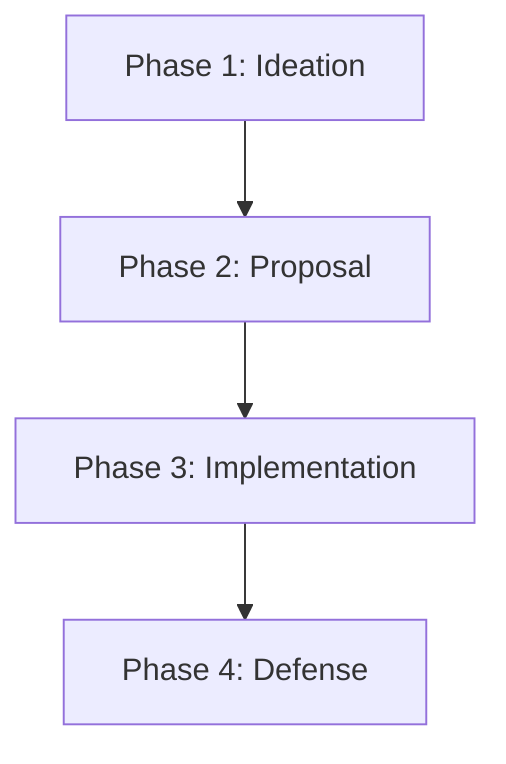

# Project Overview

Below is an interactive chart showing the project phases. **Click on a box** to jump to that section in the [Checklist](./CHECKLIST.md).

## How it works
This uses **Mermaid.js**, which is supported natively by GitHub and VS Code. 
- The `click` command assigns a link to the node.
- In VS Code, you may need to `Ctrl + Click` depending on your settings.
- On GitHub, these links will navigate within the repository.
